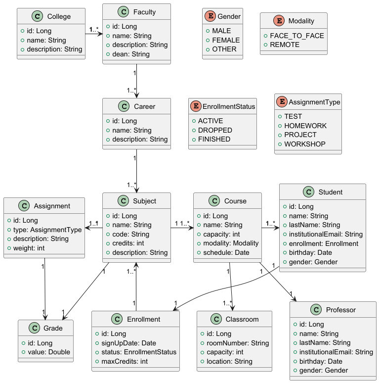

# College System

## Description

This is an application that simulates a college system, supporting the roles of **Student**, **Professor**, and **Administrator**, with functionalities for:

- Assigning subjects and professors
- Creating courses (parallels) with schedules
- Enrolling students in courses
- Registering and consulting grades
- Managing faculties and academic structure

---

## Table of Contents

- [Planning](#planning)
- [Analysis](#analysis)
- [Design](#design)
- [How to run this project](#how-to-run)

---

## Planning

- **Roles**:
    - `Student`: registers in subjects, views grades and schedules.
    - `Professor`: manages subjects, courses and assigns grades.
    - `Administrator`: creates subjects, manages faculties and assignments.

- **Core Functionalities**:
    - Enrollment management
    - Subject and course creation
    - Grade assignment and consultation
    - Schedule validation

---

## Analysis

### Main Entities

- `Student`: Identified by ID and enrollment, linked to a faculty.
- `Professor`: Assigned to subjects and courses, belongs to a faculty.
- `Subject`: Carries code, name, credits, and is taught through courses.
- `Course`: A parallel of a subject, with schedule, room, modality, and a professor.
- `Grade`: Assigned once per student-course relationship.
- `Enrollment`: Records subjects a student registers per term.
- `Faculty`: Groups subjects, professors, and students.

### Business Rules

| ID  | Rule                                                                 |
|-----|----------------------------------------------------------------------|
| R1  | A student cannot register for the same subject in multiple courses. |
| R2  | A professor cannot be assigned to overlapping course schedules.     |
| R3  | A subject must have at least one active course.                     |
| R4  | Enrollment requires valid subject and course.                       |
| R5  | Each student-course has exactly one grade.                          |
| R6  | Students or subjects with active dependencies cannot be deleted.    |

### UML Class Diagram




### DB Schema


---

## Design

---

## How to run

### Start the database and dependencies

Make sure you have Docker installed. From the project root, run:

```bash
docker compose up -d
```

### Run the Java application

After the containers are running, execute the application using your preferred method:

From an IDE (e.g., IntelliJ IDEA, Eclipse) → run the main class of the Spring Boot application.

Or from the terminal:

```bash
./mvnw spring-boot:run
```